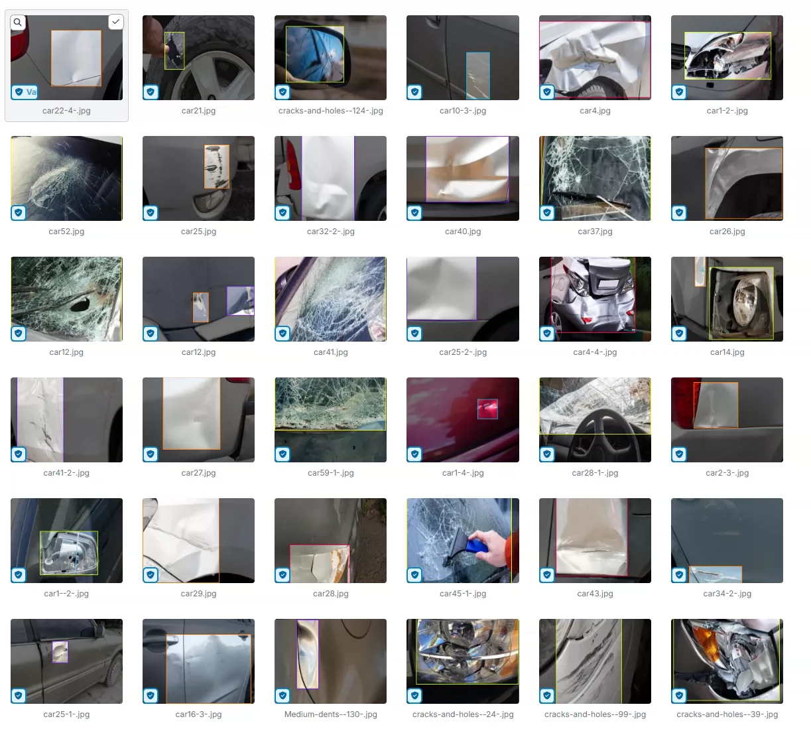
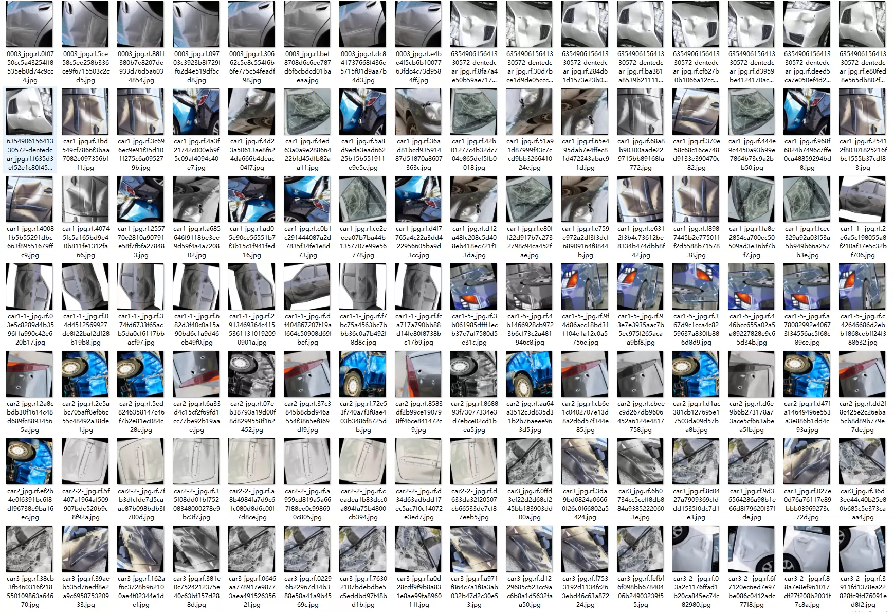
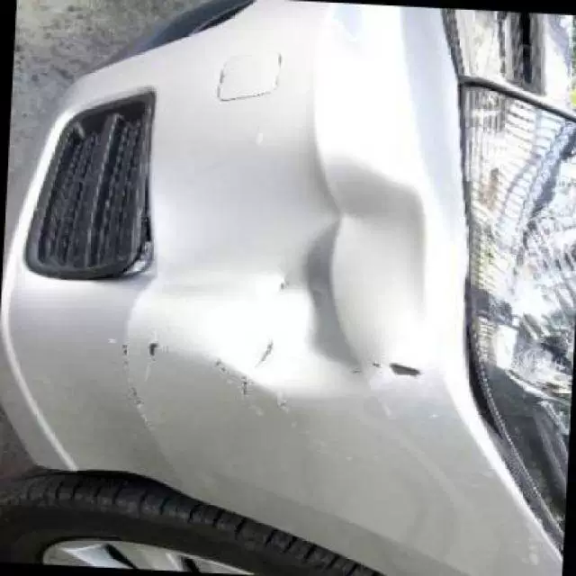
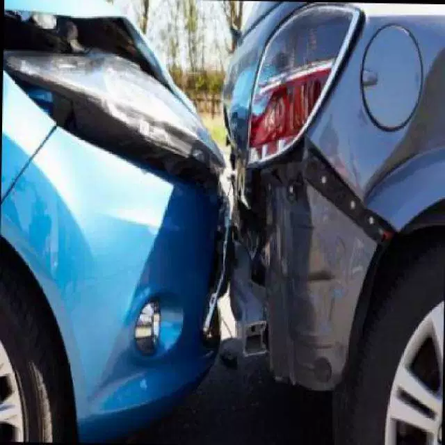
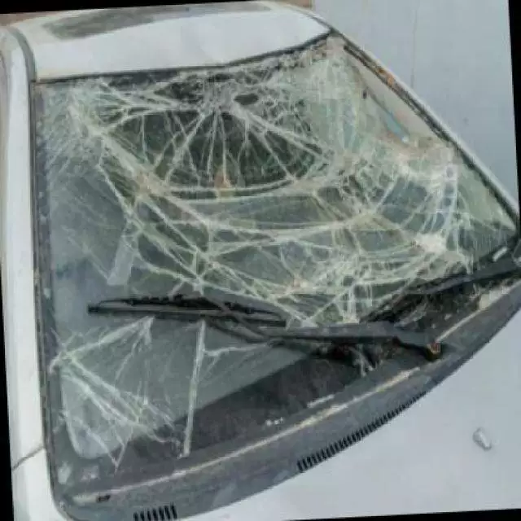
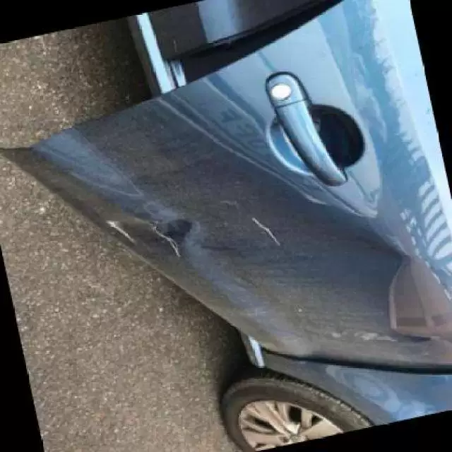
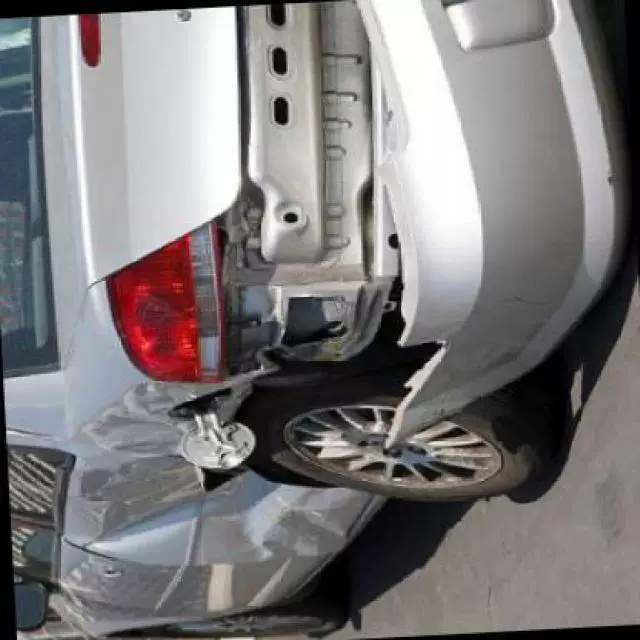

## Body

Vehicle Damage Detection Dataset in YOLO format

A total of 6416 images are available, each labeled and divided into training set, test set, and validation set. The dataset is divided into seven categories: 'crack_and_hole', 'medium_deformation', 'severe_deformation', 'severe_scratch', 'slight_deformation', 'slight_scratch', 'windshield_damage'.

"Cracks and Holes", "Medium Deformation", "Severe Deformation", "Severe Scratch", "Slight Deformation", "Slight Scratch", "Windshield Damage"

Electronic virtual products sold are not returnable.

## Images

Here is a pay link on Stripe ( https://buy.stripe.com/3cs8yP7sY87d0vu9AB ). Please contact me lonlonago@foxmail.com after funding $89, and I will send you a complete data files , thank you!

